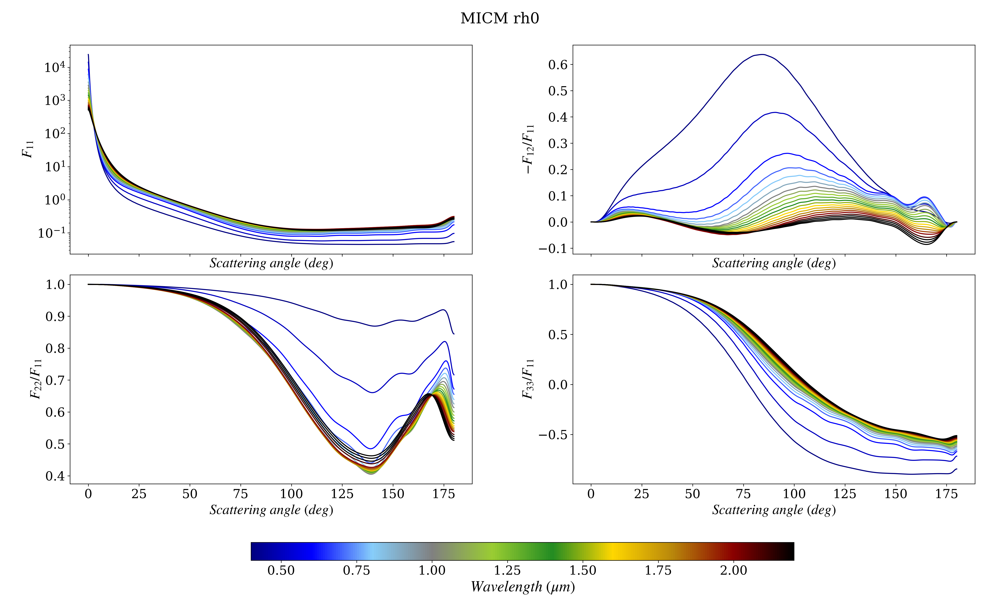
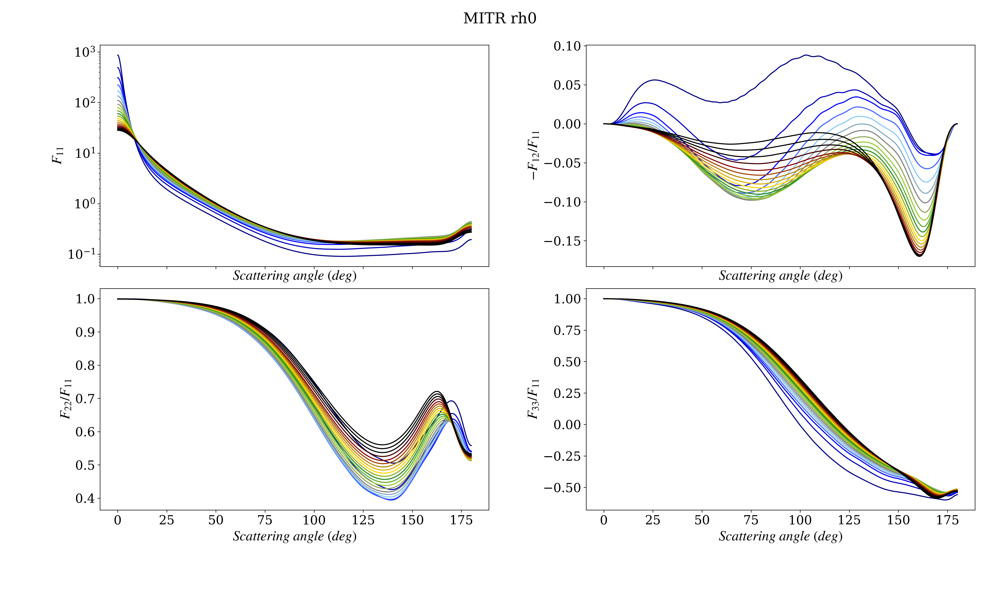
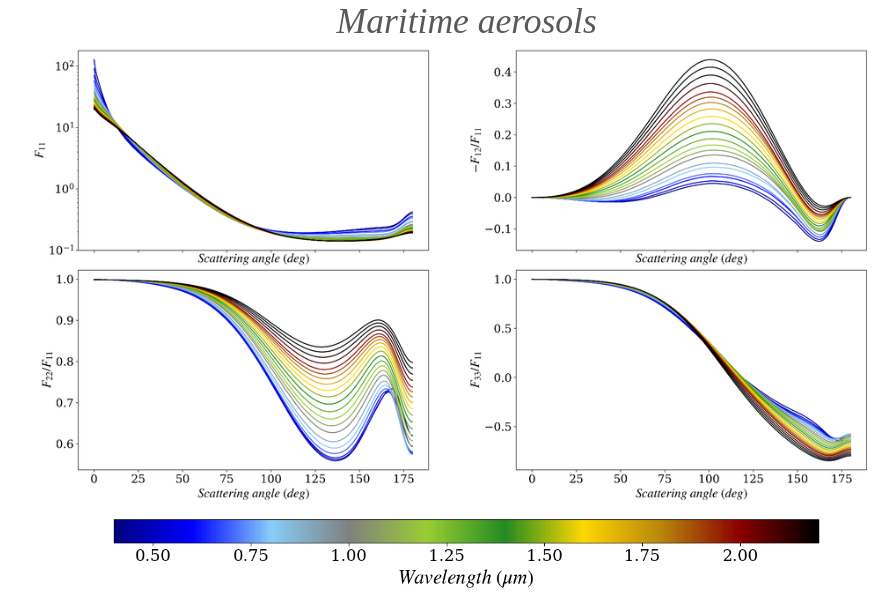

# MOPSMAP toolbox 
## Snippets of scientific code for scattering matrix and optical parameters computation based on the MOPSMAP repository.
MOPSMAP reference:
Gasteiger, J. and Wiegner, M. (2018). Mopsmap v1.0: A versatile tool for the modeling of aerosol optical properties. Geoscientific Model Development, 11:2739–2762.

### Examples

Check notebooks for basic examples. You could be able to reproduce massive computation and get scattering matrix for different size (or refractive index) distrubtions.

 
 
 

 
